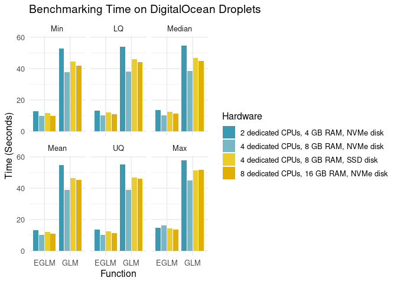

<!-- README.md is generated from README.Rmd. Please edit that file -->

# Efficient Fitting of Linear and Generalized Linear Models 

<!-- badges: start -->

[](https://www.repostatus.org/#active)
[](https://www.tidyverse.org/lifecycle/#stable)
[](https://cran.r-project.org/package=eflm)
[](https://codecov.io/gh/pachamaltese/eflm)
[](https://github.com/pachamaltese/yotover-testing/actions)
<!-- badges: end -->

## Description

Efficient Fitting of Linear and Generalized Linear Models by using just
base R. As an alternative to `lm()` and `glm()`, this package provides
`elm()` and `eglm()`, with a significant speedup when the number of
observations is larger than the number of parameters to estimate. The
speed gains are obtained by reducing the NxP model matrix to a PxP
matrix, and the best computational performance is obtained when R is
linked against OpenBLAS, Intel MKL or other optimized BLAS library. This
implementation aims at being compatible with ‘broom’ and ‘sandwich’
packages for summary statistics and clustering by providing S3 methods.

## Details

This package takes ideas from glm2, speedglm, fastglm, and fixest
packages, but the implementations here shall keep the functions and
outputs as closely as possible to the stats package, therefore making
the functions provided here compatible with packages such as sandwich
for robust estimation, even if that means to attenuate the speed gains.

The greatest strength of this package is testing. With more than 750
(and counting) tests, we try to do exactly the same as lm/glm, even in
edge cases, but faster.

The ultimate aim of the project is to produce a package that:

-   Does exactly the same as lm and glm in less time
-   Is equally numerically stable as lm and glm
-   Depends only on base R, with no Rcpp or other calls
-   Uses R’s internal C code such as the `Cdqrls` function that the
    stats package uses for model fitting
-   Can be used in Shiny dashboard and contexts where you need fast
    model fitting
-   Is useful for memory consuming models
-   Allows model fitting with limited hardware

## Minimal working example

### Stats (base) package

``` r
formula <- "mpg ~ I(wt^2)"
summary(glm(formula, data = mtcars))
#> 
#> Call:
#> glm(formula = formula, data = mtcars)
#> 
#> Deviance Residuals: 
#>     Min       1Q   Median       3Q      Max  
#> -5.1583  -2.3882  -0.9648   1.8254   8.2256  
#> 
#> Coefficients:
#>             Estimate Std. Error t value Pr(>|t|)    
#> (Intercept) 28.05106    1.26324   22.21  < 2e-16 ***
#> I(wt^2)     -0.70583    0.09616   -7.34 3.56e-08 ***
#> ---
#> Signif. codes:  0 '***' 0.001 '**' 0.01 '*' 0.05 '.' 0.1 ' ' 1
#> 
#> (Dispersion parameter for gaussian family taken to be 13.42544)
#> 
#>     Null deviance: 1126.05  on 31  degrees of freedom
#> Residual deviance:  402.76  on 30  degrees of freedom
#> AIC: 177.86
#> 
#> Number of Fisher Scoring iterations: 2
```

### Eflm package

``` r
library(eflm)
summary(eglm(formula, data = mtcars))
#> 
#> Call:
#> eglm(formula = formula, data = mtcars)
#> 
#> Deviance residuals:
#>     Min       1Q   Median       3Q      Max  
#> -5.1583  -2.3882  -0.9648   1.8254   8.2256  
#> 
#> Coefficients:
#>             Estimate Std. Error t value  Pr(>|t|)    
#> (Intercept)  28.0511    1.26324   22.21 3.548e-20 ***
#> I(wt^2)      -0.7058    0.09616   -7.34 3.556e-08 ***
#> ---
#> Signif. codes:  0 '***' 0.001 '**' 0.01 '*' 0.05 '.' 0.1 ' ' 1 
#> 
#> (Dispersion parameter for gaussian family taken to be 13.42544)
#> 
#>     Null deviance: 1126.05  on 31  degrees of freedom
#> Residual deviance:  402.76  on 30  degrees of freedom
#> AIC: 177.86
#> 
#> Number of Fisher Scoring iterations: 1
```

## Installation

You can install the released version of eflm from CRAN with:

``` r
install.packages("eflm")
```

And the development version with:

``` r
remotes::install_github("pachamaltese/eflm")
```

## Benchmarks

Let’s fit two computationally demanding models from [Yotov, et
al. (2016)](https://pacha.dev/yotover/).

The dataset for the benchmark was also taken from Yotov, et al. and
consists in a 28,152 x 8 data frame with 6 numeric and 2 categorical
columns:

``` r
trade_data_yotov
#> # A tibble: 28,152 x 8
#>     year  trade   dist  cntg  lang  clny exp_year imp_year
#>    <int>  <dbl>  <dbl> <int> <int> <int> <chr>    <chr>   
#>  1  1986  27.8  12045.     0     0     0 ARG1986  AUS1986 
#>  2  1986   3.56 11751.     0     0     0 ARG1986  AUT1986 
#>  3  1986  96.1  11305.     0     0     0 ARG1986  BEL1986 
#>  4  1986   3.13 12116.     0     0     0 ARG1986  BGR1986 
#>  5  1986  52.7   1866.     1     1     0 ARG1986  BOL1986 
#>  6  1986 405.    2392.     1     0     0 ARG1986  BRA1986 
#>  7  1986  48.3   9391.     0     0     0 ARG1986  CAN1986 
#>  8  1986  23.6  11233.     0     0     0 ARG1986  CHE1986 
#>  9  1986 109.    1157.     1     1     0 ARG1986  CHL1986 
#> 10  1986 161.   19110.     0     0     0 ARG1986  CHN1986 
#> # … with 28,142 more rows
```

The variables are:

-   year: time of export/import flow
-   trade: bilateral trade
-   log\_dist: log of distance
-   cntg: contiguity
-   lang: common language
-   clny: colonial relation
-   exp\_year/imp\_year: exporter/importer time fixed effects

### OLS estimation controlling for multilateral resistance terms with fixed effects

*This test was conducted on a 2 dedicated CPUs and 4GB of RAM
DigitalOcean droplet.*

The general equation for this model is:

By running regressions with cumulative subset of the data for 1986, …,
2006 (e.g. regress for 1986, then 1986 and 1990, …, then 1986 to 2006),
we obtain the next fitting times depending on the design matrix
dimensions:


The general equation for this model is:

### PPML estimation controlling for multilateral resistance terms with fixed effects:

*This test was conducted on a 2 dedicated CPUs and 4GB of RAM
DigitalOcean droplet.*

By running regressions with cumulative subset of the data for 1986, …,
2006 (e.g. regress for 1986, then 1986 and 1990, …, then 1986 to 2006),
we obtain the next fitting times depending on the design matrix
dimensions:



### Performance on scaled hardware

*This test was conducted on different dedicated CPUs DigitalOcean
droplets.*

We can repeatedly run the Quasi-Poisson regression with the full dataset
and compare the results on different hardware.

The results which are very consistent across different hardware (this is
surprising, more CPUs don’t reduce the median fitting time). The next
plot summarises 4,000 repetitions of the tests, with 500 repetions for
both `glm()` and `eglm()` on different hardware:


## Progress list

### Sandwich compatibility

-   [x] estfun
-   [x] bread
-   [x] vcovCL
-   [x] meatCL
-   [x] vcovCL
-   [x] vcovBS
-   [ ] vcovHC
-   [ ] meatHC
-   [ ] vcovPC
-   [ ] meatPC
-   [ ] vcovPL
-   [ ] meatPL

### Broom compatibility

-   [x] augment
-   [x] tidy

### CAR

RESIDUALPLOTS cooks.distance? hatvalues? influenceIndexPlot
influencePlot QQpLOT compareCoefs

ver fit4 &lt;- update(fit, subset=!(rownames(datos2) %in%
c(“NY”,“SD”,“TX”,“NV”,“CT”)) )
