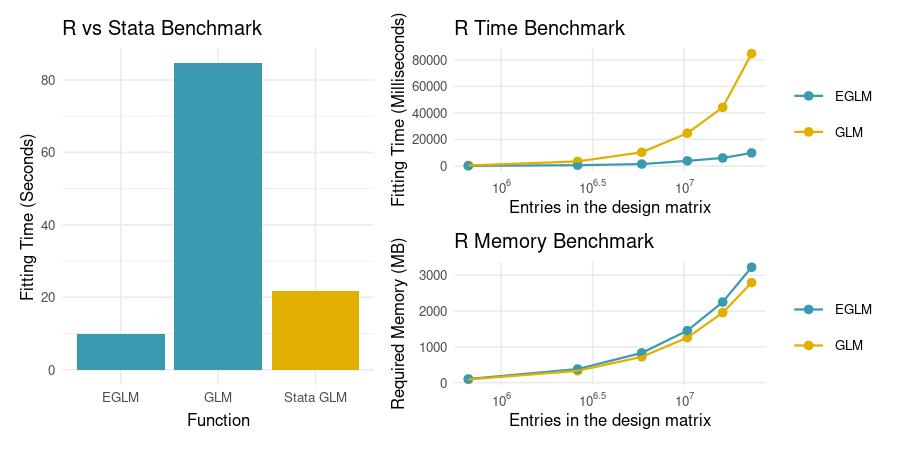
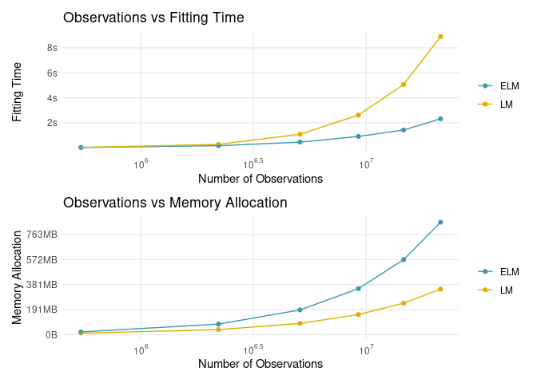
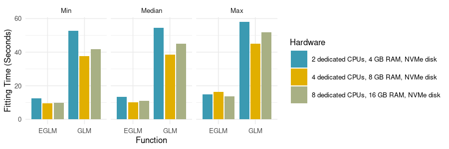

<!-- README.md is generated from README.Rmd. Please edit that file -->

# Efficient Fitting of Linear Models

<!-- badges: start -->

[](https://www.repostatus.org/#active)
[](https://www.tidyverse.org/lifecycle/#stable)
[](https://cran.r-project.org/package=eflm)
[](https://codecov.io/gh/pachadotdev/eflm)
[](https://github.com/pachadotdev/eflm/actions)
<!-- badges: end -->

## Scope

`eflm` package reduces the design matrix from *N* × *P* into *P* × *P*
for reduced fitting time, and delivers functions that are drop-in
replacements for `glm` and `lm`, like:

``` r
# just append and 'e' to glm
eglm(mpg ~ wt, data = mtcars)
```

The best computational performance is obtained when R is linked against
OpenBLAS, Intel MKL or other optimized BLAS library. This implementation
aims at being compatible with ‘broom’ and ‘sandwich’ packages for
summary statistics and clustering by providing S3 methods.

This package takes ideas from glm2, speedglm, fastglm, speedglm and
fixest packages, but the implementations here shall keep the functions
and outputs as closely as possible to the stats package, therefore
making the functions provided here compatible with packages such as
sandwich for robust estimation, even if that means to attenuate the
speed gains.

The greatest strength of this package is testing. With more than 1600
(and counting) tests, we try to do exactly the same as lm/glm, even in
edge cases, but faster.

The ultimate aim of the project is to produce a package that:

-   Does exactly the same as lm and glm in less time
-   Is equally numerically stable as lm and glm
-   Depends only on base R, with no Rcpp or other calls
-   Uses R’s internal C code such as the `Cdqrls` function that the
    stats package uses for model fitting
-   Can be used in Shiny dashboard and contexts where you need fast
    model fitting
-   Is useful for memory consuming models
-   Allows model fitting in cases demanding more memory than free RAM
    (PENDING)

## Installation

You can install the released version of eflm from CRAN with:

``` r
install.packages("eflm")
```

And the development version with:

``` r
remotes::install_github("pachadotdev/eflm")
```

## Progress list

### Stats compatibility

-   [x] cooks.distance

### Sandwich compatibility

-   [x] estfun
-   [x] bread
-   [x] vcovCL
-   [x] meatCL
-   [x] vcovCL
-   [x] vcovBS
-   [ ] vcovHC
-   [ ] meatHC
-   [ ] vcovPC
-   [ ] meatPC
-   [ ] vcovPL
-   [ ] meatPL

### Broom compatibility

-   [x] augment
-   [x] tidy
-   [x] glance

### Lmtest compatibility

-   [x] resettest

## Benchmarking

The dataset for this benchmark was taken from Yotov et al. (2016) and
consists in a 28,152 x 8 data frame with 6 numeric and 2 categorical
columns of the form:

| Year (*t*) | Trade (*X*) | DIST  | CNTG | LANG | CLNY | Exp Year (*π*) | Imp Year (*χ*) |
|------------|-------------|-------|------|------|------|----------------|----------------|
| 1986       | 27.8        | 12045 | 0    | 0    | 0    | ARG1986        | AUS1986        |
| 1986       | 3.56        | 11751 | 0    | 0    | 0    | ARG1986        | AUT1986        |
| 1986       | 96.1        | 11305 | 0    | 0    | 0    | ARG1986        | BEL1986        |

This data can be found in the `tradepolicy` package.

The variables are:

-   `year`: time of export/import flow
-   `trade`: bilateral trade
-   `log_dist`: log of distance
-   `cntg`: contiguity (0/1)
-   `lang`: common language (0/1)
-   `clny`: colonial relation (0/1)
-   `exp_year`/`imp_year`: exporter/importer time fixed effects

For benchmarking I’ll fit a PPML model, as it’s a computationally
expensive model.

``` r
ch1_application1 <- tradepolicy::agtpa_applications %>%
  select(exporter, importer, pair_id, year, trade, dist, cntg, lang, clny) %>%
  filter(year %in% seq(1986, 2006, 4))
  
formula <- trade ~ log(dist) + cntg + lang + clny + exp_year + imp_year
eglm(formula, quasipoisson, ch1_application1)
```

To compare `glm`, the proposed `eglm` and Stata’s `ppml`, I conducted a
test with 500 repetitions locally, and reported the median of the
realizations as the fitting time. The plots on the right report the
fitting times and used memory by running regressions with cumulative
subset of the data for 1986, …, 2006 (e.g. regress for 1986, then 1986
and 1990, …, then 1986 to 2006), we obtain the next fitting times and
memory allocation depending on the design matrix dimensions:



Yotov et al. (2016) features complex both partial and general
equilibrium models. Some partial equilibrium models are particularly
slow to fit because of the allocated memory and the number of fixed
effects, such as the Regional Trade Agreements (RTAs) model.

In the next table, TG means ‘Traditional Gravity’ (e.g. vanilla PPML),
DP means ‘Distance Puzzle’ and GB stands for ‘Globalization’, which are
refinements of the simple PPML model and include dummy variables such as
specific country pair fixed effects and lagged RTAs.

| Model    | Rows in design matrix | Cols in design matrix |
|:---------|----------------------:|----------------------:|
| TG, PPML |                 28152 |                   831 |
| DP, FE   |                 28566 |                   905 |
| RTAs, GB |                 28482 |                  3175 |



The results for the RTA model show that the speedups can be scaled, and
we can show both time reduction and required memory increases.

| Model    | GLM Time (s) | EGLM Time (s) | Time Gain (%) |
|:---------|-------------:|--------------:|:--------------|
| DP, FE   |        111.0 |          9.08 | 91.82%        |
| RTAs, GB |       1824.0 |        161.40 | 91.15%        |
| TG, PPML |        108.6 |          9.06 | 91.66%        |

Is it important to mention that the increase in memory results in
reduced object size for the stored model.

| Model    | GLM Size (MB) | EGLM Size (MB) | Memory Savings (%) |
|:---------|--------------:|---------------:|:-------------------|
| DP, FE   |        231.04 |          37.26 | 83.87%             |
| RTAs, GB |        824.89 |         263.36 | 68.07%             |
| TG, PPML |        210.88 |          34.69 | 83.55%             |

To conclude my benchmarks, I fitted the PPML model again on DigitalOcean
droplets, leading to consistent times across scaled hardware. The
results can be seen in the next plot:


## Edge cases

An elementary example that breaks `eflm` even with QR decomposition can
be found in Golub et al. (2013), which consists in passing an ill
conditioned matrix:

| Model | (Intercept) | *x*<sub>1</sub> | *x*<sub>2</sub> |
|-------|-------------|-----------------|-----------------|
| REG 1 | 1.98        | 2.98            | 1.02            |
| REG 2 | 1.98        | 4.00            | NA              |

# References

Golub, Gene H, and Charles F Van Loan. 2013. *Matrix Computations*. Vol.
3. JHU press.

Yotov, Yoto V, Roberta Piermartini, José-Antonio Monteiro, and Mario
Larch. 2016. *An Advanced Guide to Trade Policy Analysis: The Structural
Gravity Model*. World Trade Organization Geneva.
